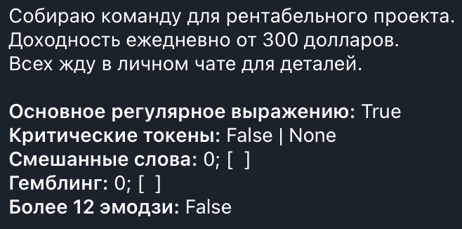

# Gatekeeper: Telegram-бот для удаления спама

Ссылка: https://t.me/tw_antispam_mini_bot

Версия: `v0.2.0`

## Введение

Этот бот предназначен для автоматического определения и удаления спама на основе регулярных выражений в группах технической тематики. Он позволяет администраторам регистрировать чаты, в которых будет удаляться спам, а логи удаленного спама пересылаются в диалог администратора чата с ботом.

Также можно разрешить команду `/ban` для запуска голосования прямо в чате за удаление сообщений.

Помимо этого, бот позволяет включать или выключать автоматическое удаление статусов. При включении будут удаляться все статусные сообщения — о вступлении нового пользователя, выходе из чата, закреплении сообщения и т.д.

**Новое в версии 0.2.0:**
- Пользовательские команды через JSON-файл (`/setrule`, `/delrule`, `/ruleslist`)
- Многоуровневая антиспам-система (критический спам → бан, обычный спам → удаление)
- Автоматическое удаление рекламы ботов
- Эхо-функция в личных чатах
- Обработка отредактированных сообщений

Создан с помощью библиотеки `python-telegram-bot`.

## Критерии спама

Бот автоматически удаляет сообщения и банит отправителей при наличии одного из следующих признаков:

### Критический спам (бан + удаление)
1. Присутствуют критические спам-фразы (например, "срочно требуются", "пассивный доход" и т.д.)
2. Сообщение содержит два и более слов, состоящих из сочетания кириллического и любого не-кириллического алфавита
3. В сообщении есть 12 и более эмодзи

### Обычный спам (только удаление)
1. Присутствуют обычные спам-фразы без критических паттернов
2. Реклама ботов (@username_bot, t.me/username_bot)

При бане и удалении фиксируются критерии, на основании которых бот удалил сообщение:



## Как начать работу

1. Добавьте бота в нужный чат и сделайте его администратором. Выдайте боту права на удаление сообщений.
2. Начните диалог с ботом, отправив команду `/start`.
3. Используйте команду `/register <chat_id>` для регистрации чата.

Удаление сообщений по команде `/ban` и автоматическое удаление статусов отключены. Если вам нужны эти возможности, включите каждую из них отдельно, как показано ниже.

### Как работает регистрация

Регистрация необходима для любых действий бота в каком-либо чате. Только администраторы чата могут зарегистрировать его с помощью команды `/register`. При отмене регистрации чата с помощью команды `/unregister` все настройки для этого чата удаляются из базы данных.

Чтобы бот удалял сообщения в чате, хотя бы один администратор должен иметь активную регистрацию в этом чате. Бот отправляет удаленные спам-сообщения из чата тем администраторам, которые зарегистрировали чат. Это позволяет администраторам просматривать удаленные сообщения и контролировать работу бота.

Нельзя зарегистрировать чат и в то же время отказаться от пересылки удаленных сообщений.

## Список команд

Все команды бота кроме `/ban` и пользовательских команд (`!команда`) доступны только в личной переписке с ботом. Использование команд в группах запрещено для обеспечения безопасности и предотвращения несанкционированного доступа.

Чтобы получить идентификатор чата для регистрации, используйте один из сторонних ботов, например `@username_to_id_bot` или `@getmy_idbot`. В дальнейшем идентификаторы ваших зарегистрированных чатов можно получить с помощью команды `/list`.

### Команды для личного чата

| Команда | Описание |
|---------|----------|
| /start | Начать работу с ботом |
| /help | Показать справку по командам |
| /register \<chat_id\> | Зарегистрировать чат |
| /unregister \<chat_id\> | Отменить регистрацию чата |
| /list | Показать список зарегистрированных чатов |
| /allow_manual \<chat_id\> | Разрешить использование команды /ban в чате |
| /cancel_manual \<chat_id\> | Запретить использование команды /ban в чате |
| /delete_statuses \<chat_id\> | Включить автоматическое удаление статусов |
| /allow_statuses \<chat_id\> | Отключить автоматическое удаление статусов |
| /ruleslist | Показать список всех сохраненных пользовательских команд |
| /setrule `!команда` `Текст` | Создать новую или обновить существующую команду |
| /delrule `!команда` | Удалить существующую команду |

### Команды для групповых чатов

| Команда | Описание |
|---------|----------|
| /ban | Запустить голосование среди участников чата за удаление сообщения (требуется /allow_manual) |
| !команда | Выполнить пользовательскую команду (только для администраторов) |

### Команда бана

Бот поддерживает команду `/ban` для удаления сообщений и бана пользователей:

1. Сначала необходимо разрешить ручной бан для чата, используя команду `/allow_manual <chat_id>` в личной переписке с ботом.
2. Чтобы запретить ручной бан для чата, используйте команду `/cancel_manual <chat_id>` в личной переписке с ботом.
3. Ответьте на сообщение командой `/ban`.
4. Бот создаст сообщение с кнопками "Подтвердить" и "Отменить" в ответ на оригинальное сообщение.
5. Для выполнения действия требуется 3 голоса (включая инициатора).
   При подтверждении сообщение удаляется, а пользователь получит бан.
   При отмене никаких действий не совершается.
6. После завершения голосования сообщение бота и команда `/ban` удаляются.
7. Нельзя начать новое голосование для сообщения, если для него уже идет активное голосование.

### Удаление статусов

* **Удаление статусов:** После регистрации чата администратор может включить автоматическое удаление статусов с помощью команды `/delete_statuses`. По умолчанию эта функция неактивна. Когда эта функция активна, бот будет автоматически удалять все статусные сообщения в чате. Статусы — это автоматические сообщения о входе или выходе участников, изменении названия группы, закреплении сообщения и т.д.

* **Отключение удаления статусов:** Администратор может в любой момент отключить автоматическое удаление статусов в чате с помощью команды `/allow_statuses`.

## Пользовательские команды

Бот поддерживает систему пользовательских команд, которые позволяют администраторам быстро отправлять заранее заготовленные сообщения в чат.

### Создание команды

Используйте команду `/setrule` в личном чате с ботом:

```
/setrule $!команда$ $Текст ответа$
```

**Примеры:**
```
/setrule $!правила$ $Основные правила чата: 1. Не спамить 2. Быть вежливым 3. Не оффтопить$
/setrule $!ссылки$ $Запрещено публиковать ссылки без согласования с администрацией.$
```

**Многострочный текст:**
```
/setrule $!вк$ $Наш клуб под угрозой.
Если телеграм перестанет работать - мы не найдем друг друга.

Чтобы не потеряться - подписывайтесь на Зону роста вк.
ОБЯЗАТЕЛЬНО присоединяйтесь: https://vk.com/club236116938$
```

**Требования:**
- Команда должна начинаться с символа `!`
- Текст ответа не может быть пустым
- Текст ответа не может превышать 4096 символов (лимит Telegram)
- Знаки доллара внутри текста ответа запрещены
- Используйте `$` как разделитель вместо обратных кавычек (это позволяет сохранять переносы строк)

### Просмотр команд

Команда `/ruleslist` показывает список всех сохраненных пользовательских команд.

### Удаление команды

Используйте команду `/delrule` в личном чате с ботом:

```
/delrule $!команда$
```

### Использование в чате

1. Отправьте в групповой чат сообщение, содержащее только команду (например, `!правила`)
2. Бот удалит ваше сообщение и отправит соответствующий текст в чат
3. Если ваше сообщение было ответом на другое сообщение, бот ответит на то же сообщение

**Важно:**
- Команды доступны только администраторам чата
- Команды глобальные — созданные в одном чате, они доступны во всех чатах, где бот является администратором
- Сообщения от обычных пользователей, начинающиеся с `!`, игнорируются

## Хранение данных

Пользовательские команды хранятся в файле `custom_commands.json` в рабочей директории бота. Файл имеет следующую структуру:

```json
{
  "!ссылки": "Запрещено публиковать ссылки без согласования с администрацией.",
  "!правила": "Основные правила чата: 1. Не спамить...",
  "!вк": "Ссылки на ВК запрещены."
}
```

Файл создается автоматически при первом запуске бота. Все изменения сохраняются синхронно.

## Эхо-функция

В личном чате с ботом работает эхо-функция: бот отзеркаливает любые сообщения, не начинающиеся с `/` или `!`. Это удобно для тестирования форматирования текста.

## Обработка отредактированных сообщений

Бот проверяет на спам не только новые сообщения, но и отредактированные. Если пользователь отредактировал сообщение, добавив в него спам-контент, бот применит те же санкции, что и к новому сообщению.
